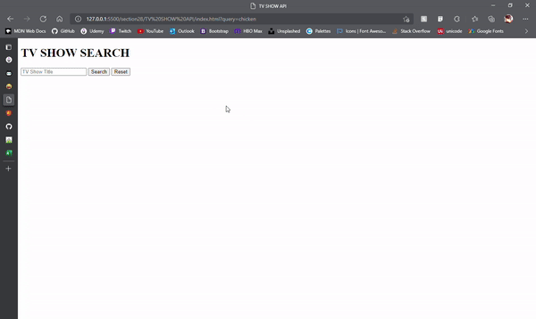

<h1 align="center">TV SHOW SEARCHER</h1>

---
<h3>
Project developed using the TV MAZE API study, implementing AXIOS (promise based HTTP client for the browser and Node. js), JavaScript and HTML.
</h3>

---

  

